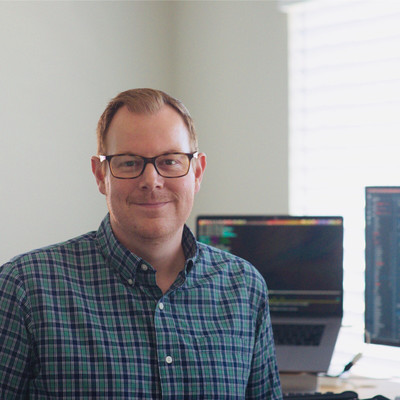

  

## Academic and Early Career
I attended university at Morehead State University in the department of Math
and Physics where I received a dual degree in Computer Science and Physics.

My experiences at MSU led to a career as a Software Engineer at the National
Radio Astronomy Observatory. While at the NRAO, I worked on projects that
involved analysis of observational data in the radio spectrum, monitor and
control systems for the world's largest fully movable telescope, and an
automated system that factors in weather forecast to maximize science. I also
spent some time at the National Institute for Computational Sciences 
located at Oak Ridge National Lab. During my time at NICS, I worked in the High
Performance Computing Operations group which ran the National Science
Foundation’s first petaflop supercomputing system (the Kraken).

After my time at the observatory, I began working in the private industry focusing on web / mobile
application development, data analysis pipelines, large data business
intelligence applications, and open source / enterprise data science tools and
platforms.

## Recent Work

I recently worked at the Center for Machine Learning at [Capital
One](https://www.capitalone.com), where I built and led a team of engineers
building Machine Learning Tools for internal practioners. These tools leverage
open source software projects such as [Dask](https://www.dask.org),
[RAPIDS](https://www.rapids.ai), and [XGBoost](https://xgboost.readthedocs.io/). We also
open sourced one of the tools, [Rubicon
ML](https://capitalone.github.io/rubicon-ml/).

I currently work at NVIDIA on building accelerated data science and machine learning libraries. My teams 
are focused on Devops, Build Engineering, Enterprise Distribution and Deployment for NVIDIA CUDA Libraries 
like cuDF, cuML, and cuVS. 